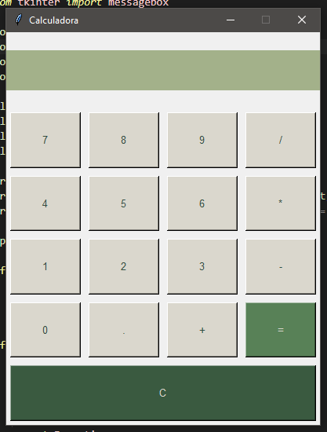

# Calculadora en Python ☘︎ ݁˖

Una calculadora simple y funcional desarrollada con Python y Tkinter.

## ☘︎ ݁˖ Descripción

Esta aplicación de escritorio proporciona una interfaz gráfica intuitiva para realizar operaciones matemáticas básicas. Diseñada con una interfaz limpia y moderna, permite realizar cálculos de manera rápida y eficiente.

## ☘︎ ݁˖ Características

- Operaciones básicas: suma, resta, multiplicación y división
- Soporte para números decimales
- Interfaz gráfica responsive
- Manejo de errores con mensajes informativos
- Botón de limpieza para reiniciar operaciones
- Diseño moderno con esquema de colores personalizado

## ☘︎ ݁˖ Requisitos

- Python 3.x
- Tkinter (incluido por defecto en la mayoría de instalaciones de Python)

## ☘︎ ݁˖ Uso

- Haz clic en los botones numéricos para ingresar números
- Selecciona la operación deseada (+, -, *, /)
- Presiona "=" para obtener el resultado
- Usa el botón "C" para limpiar la pantalla y comenzar un nuevo cálculo

## ☘︎ ݁˖ Estructura del Código

- **Interfaz gráfica**: Implementada con Tkinter
- **Grid Layout**: Sistema de cuadrícula para organizar los botones
- **Manejo de eventos**: Funciones para procesar las operaciones
- **Validación**: Sistema de manejo de errores para entradas inválidas

## ☘︎ ݁˖ Captura de Pantalla

